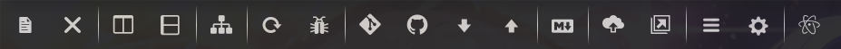

# Custom Toolbar

My custom toolbar created using tool-bar.

### Available Buttons

* __Open File__
* __Close All Tabs__
* \-
* __Split Right__
* __Split Down__
* \-
* __Reload Window__
* __Developer Tools__
* \-
* __Git Plus (Run)__
* __Git Fetch__
* __Git Force Push__
* __Git Pull__
* __Git Push__
* \-
* __Markdown Preview__
* __HTML Preview__
* \-
* __Backup__
* __View Backup__
* \-
* __Command Palette__
* __Preferences__
* \-
* __About Atom__

### Optional Dependencies

* __git-plus__
* __sync-settings__

